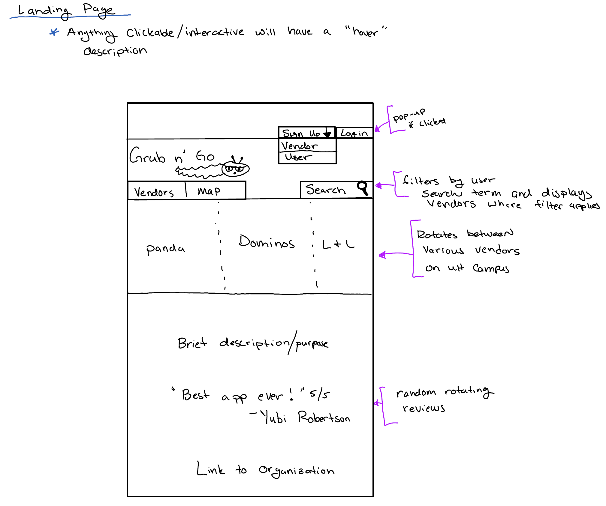
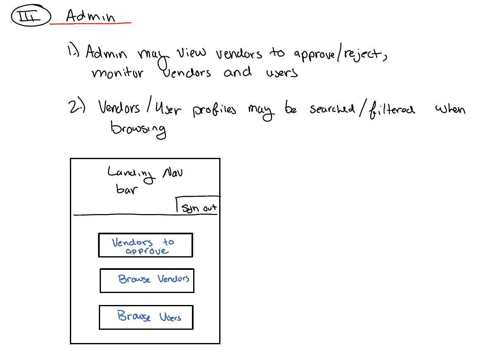
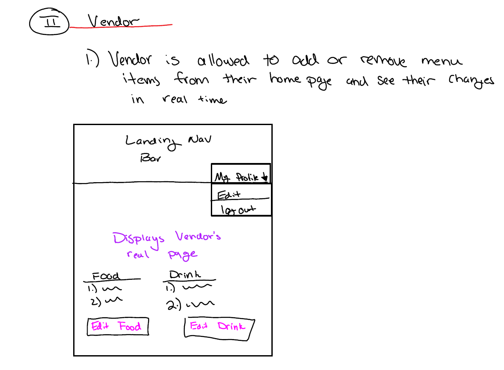
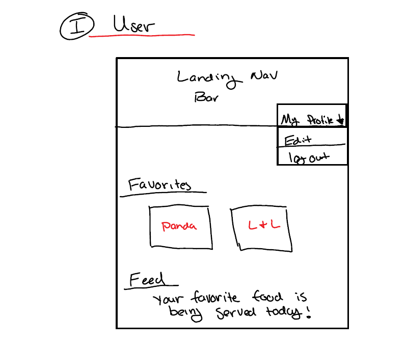
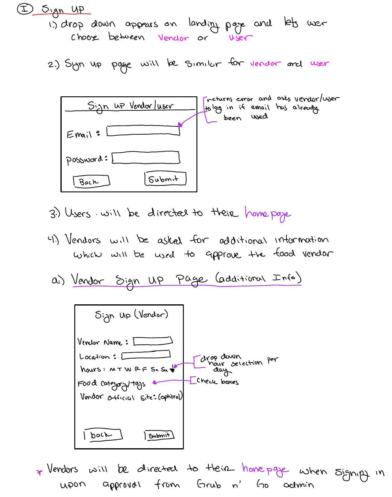
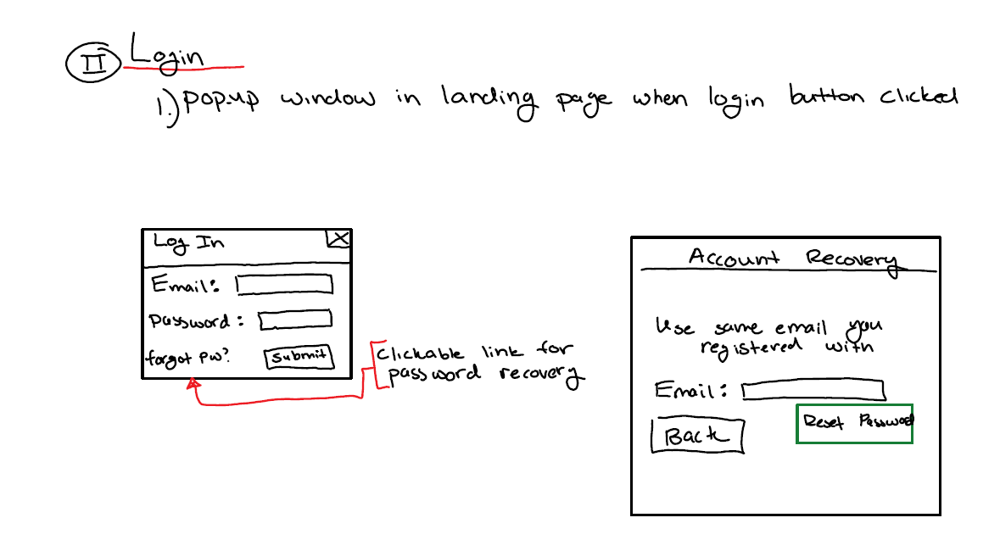
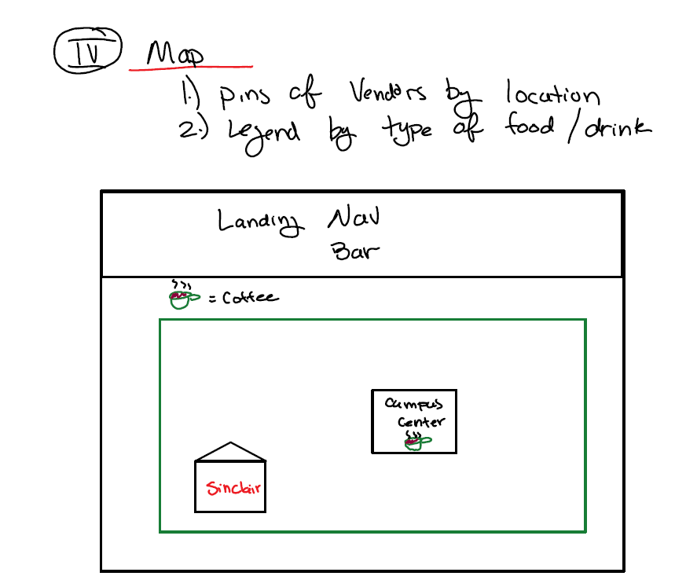

<div id="banner" align="center">
   <span id="logo"></span>
    <a href="https://github.com/grubngo/grubngo" class="button"><strong>View On GitHub</strong></a>
    <a href="http://grubngo.meteorapp.com/#/" class="button"><strong>Link to App</strong></a>
 </div>

# About 

Grub 'n' Go is a Meteor application allowing users a convenient way to see available dining options/menus on campus. Our main goal is to help students go out and enjoy foods that they want to eat, giving information about vendors and what they sell. 

Anyone with a UH account can login to Grub 'n' Go by clicking on the login button. The UH CAS authentication screen then appears and requests your UH account and password.
 
Once authenticated, you can create a profile that provides a biographical statement and list of interests, plus links to selected social media sites (GitHub, FaceBook, Instagram):

  
After creating a profile, you will be listed on the public directory page:


Grub 'n' Go also provides a filter page, available to those who can login to the system with their UH account. The filter page allows you to display all portfolios with a given interest:


# Developer Guide

## Initialization
[install Meteor](https://www.meteor.com/install).

[download a copy of GrubNGo](https://github.com/grubngo/GrubNGo/archive/master.zip), or clone it using git.
  
Open your command terminal, changing your directory path to the /app destination. Install meteor with the following command:

```
$ meteor npm install
```

After installation completes, enter the following to run the application. 

```
$ meteor npm run start
```

Open your internet browser, enter [http://localhost:3000](http://localhost:3000) into the address bar and press enter. Your browser should show the application running locally on your computer. 

# Development History

## Milestone 1: Mockup development

This milestone started on April 2nd, 2018 and ended on April 12th, 2018.

The goal of Milestone 1 was to create the functional requirements for our application which includes: having our system deployed to Galaxy, have a landing page (with a login) and mockups of at least four other pages. Additionally there are software engineering requirements that includes using GitHub issues and a GitHub project called "M1" and practicing Issue Driven Project Management strategies. Lastly, there are home page requirements for our project's github home page. This includes (but not limited to): a link to the Github organization of this project, up-to-date screenshots, link to the running deployment of our system on Galaxy, link to the M1 project page and a link to the M2 project page.

Mockups for the following four pages were developed and then implemented during M1:
### 1. Landing

#### Mockup  
  

#### Actual Landing  


### 2. Admin Homepage

#### Mockup  
  

#### Actual Admin Homepage

### 3. Vendor Homepage

#### Mockup  
  

#### Actual Vendor Homepage

### 4. User Homepage

#### Mockup  
  

#### Actual User Homepage

### 5. Signup

#### Mockup
  

#### Actual User Login

### 6. LogIn

#### Mockup
  

#### Actual User Login

### 7. Map

#### Mockup
  

#### Actual User Login


Milestone 1 was implemented as [Grub 'n' Go GitHub Milestone M1](https://github.com/grubngo/GrubNGo/projects/1):

Each issue was implemented in its own branch, and merged into master when completed:


## Milestone 2: Data model development 

This milestone started on April 13th, 2018 and ended on April 24th, 2018.

The goal of Milestone 2 was to significantly improve the functionality and quality of our application beyond the first M1 and improve our software engineering process beyond M1.

Additionally, we had to find at least 5 UH community members to test our application and give feedback and update our organization's GitHub page to document the current version of our system.


Milestone 2 consisted of two issues, and progress was managed via the [Grub 'n' Go GitHub Project M2](https://github.com/grubngo/GrubNGo/projects/2):


Each issue was implemented in its own branch, and merged into master when completed:


# Deployment
Final look at [Grub N Go](http://grubngo.meteorapp.com/) page

# Meet The Team 
- Brian Hoole
- Chaster Mateo
- Yubi Peterson 
- Victoria Soto


